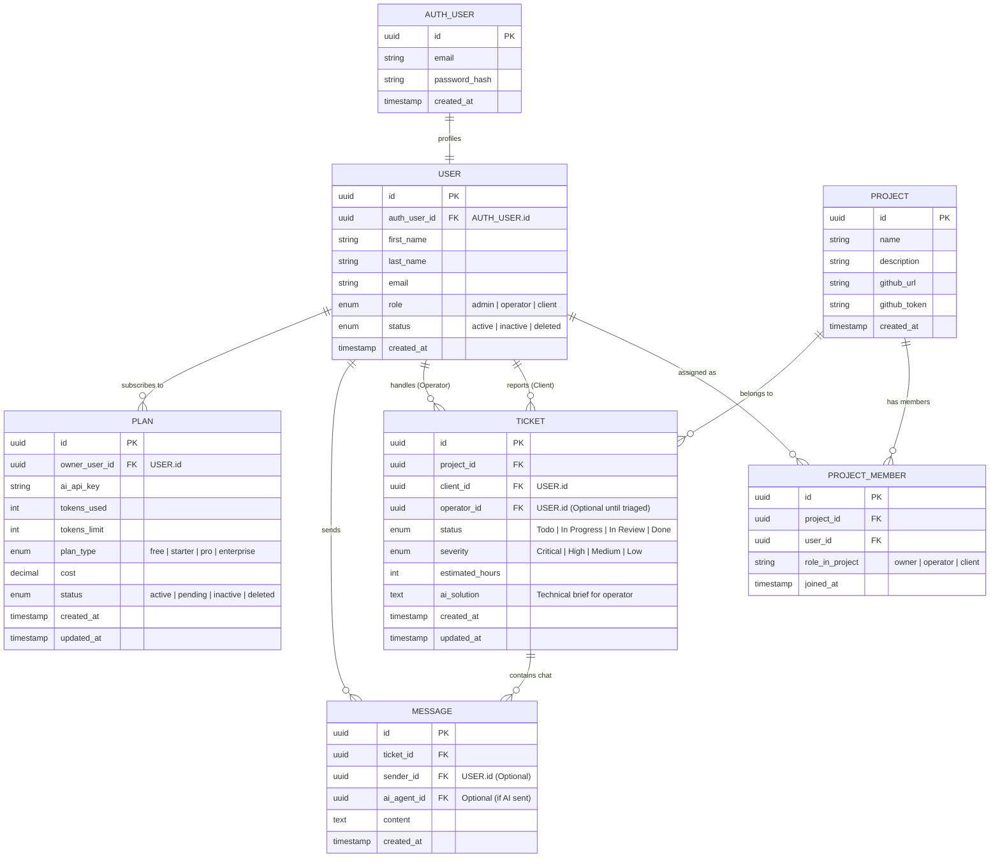

# Data Requirements & ER Analysis: BuggyFilter WebApp

## 1. Goal
The objective is to establish a robust conceptual data model that supports the AI-augmented triage process, ensuring strict data isolation between Clients and Operators while allowing for multi-tenant project management and a SaaS subscription model.

## 2. Entity Relationship Diagram (ERD)
This diagram defines the core entities and their relationships.

### Cardinality Legend
- `||--o{` : **One-to-Many (Optional)** $\rightarrow$ L'entità a sinistra è obbligatoria (1), l'entità a destra può avere zero o più occorrenze.
- `||--||` : **One-to-One (Mandatory)** $\rightarrow$ Entrambe le entità devono esistere e sono legate univocamente.
- `|o--o{` : **Zero-to-Many** $\rightarrow$ Entrambe le parti sono opzionali.

---

## 3. Data Modeling Analysis

### A. Authentication & User Profiling
- **Decoupling Auth**: Following the Supabase pattern, `AUTH_USER` handles credentials, while `USER` stores business/informational data.
- **Admin Role**: A new `admin` role has been added. Admins act as the SaaS operators who manage the mapping of users to projects and handle billing/plans.

### B. Project & GitHub Integration
- **GitHub Mapping**: The `PROJECT` table now contains the repository URL and specific token, allowing an Admin to manage multiple independent repositories for different clients.

### C. Communication Flow
- **Dual Sender Model**: The `MESSAGE` table now explicitly supports both `sender_id` (for humans) and `ai_agent_id` (for the system), enabling precise tracking of the conversation participants.

### D. SaaS & Subscription (PLANS)
- **Monetization**: The `PLAN` table tracks the AI capabilities and costs associated with the User (Owner). It controls the token quota and the specific AI model API key used for that subscription.

### E. Security Constraints (Field-Level)
- **Client View**: Access to `TICKET.id`, `TICKET.status` (simplified), and `MESSAGE` content.
- **Operator View**: Full access to all `TICKET` fields including `severity`, `estimated_hours`, and `ai_solution`.
- **Admin View**: Full access to all entities, including `PLAN` and `PROJECT` configurations.
- **API Enforcement**: The backend must explicitly strip sensitive internal technical metrics from responses when the requesting user is a 'client'.

## 4. Impact on Design
- **Frontend**: 
    - **Admin Panel**: New interface for managing Projects, Users, and Subscription Plans.
    - **Client Portal**: Chat-focused interface.
    - **Operator Dashboard**: Kanban-style board for ticket management.
- **Backend**: 
    - **Auth Guard**: Integration between `AUTH_USER` and `USER` for session management.
    - **Token Guard**: Middleware to check `PLAN.tokens_used` vs `PLAN.tokens_limit` before allowing LLM calls.
    - **GitHub Service**: Dynamic token injection based on the `PROJECT` context.
