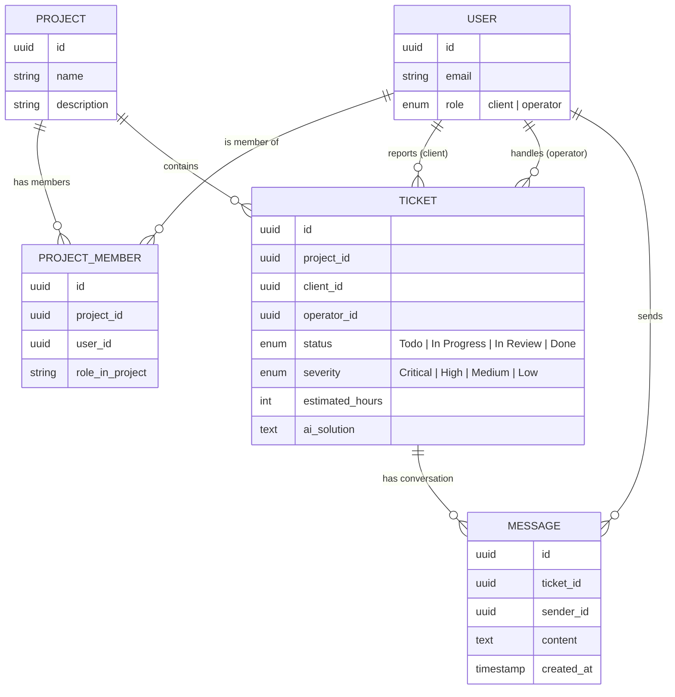
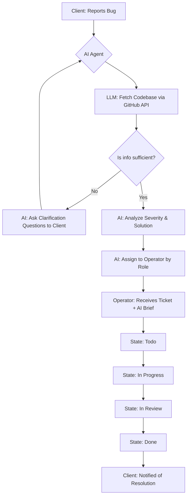

# Project Workflow & Entity Relationships

## 1. Entity Relationship Diagram (Mermaid)

## 2. Logic Flow Chart (The Triage Process)

## 3. Data Access Matrix (Security Layers)

| Entity | Client View | Operator View | AI Agent View |
| :--- | :---: | :---: | :---: |
| **Ticket Status** | ✅ (Simplified) | ✅ (Full) | ✅ (Update) |
| **Severity** | ❌ | ✅ | ✅ (Set) |
| **Estimated Time** | ❌ | ✅ | ✅ (Set) |
| **AI Solution Brief** | ❌ | ✅ | ✅ (Generate) |
| **Codebase Access** | ❌ | ✅ | ✅ (Via API) |
| **Project Members** | ❌ | ✅ | ❌ |

## 4. Key Interaction Sequences

### The "AI Triage" Loop
1. **Trigger**: `TICKET_CREATED` event.
2. **Action**: LLM reads ticket description $\rightarrow$ Searches GitHub for matching patterns.
3. **Decision**: If the bug is ambiguous, LLM triggers a `MESSAGE_SENT` to client.
4. **Resolution**: Once clarity is reached, LLM updates `TICKET` with metadata and sets `operator_id`.

### The "Resolution" Loop
1. **Trigger**: Operator updates status to `Done`.
2. **Action**: System triggers notification service.
3. **Outcome**: Client receives a final message in the chat card informing them that the bug is fixed.
